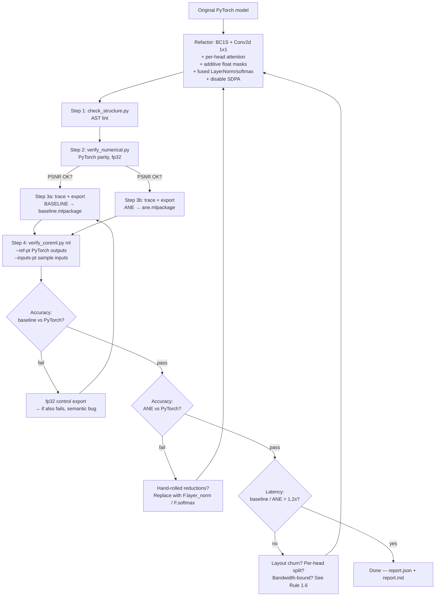

# Apple ANE Transformer Optimization

Based on Apple's [ml-ane-transformers](https://github.com/apple/ml-ane-transformers) reference and [Deploying Transformers on the Apple Neural Engine](https://machinelearning.apple.com/research/neural-engine-transformers). Targets A14+/M1+ chips.

**Progressive disclosure:** rules, decision tables, and pitfalls live here. Full copy-paste-ready PyTorch reference modules live in [`references/ane_modules.py`](references/ane_modules.py) — read that file when you need a complete class body.

---

## Part 1: ANE Optimization Rules

### Rule 1.1 — BC1S Tensor Layout + Conv2d(1×1) instead of Linear

ANE prefers `(B, C, 1, S)` over `(B, S, C)`. Last dim of ANE buffers must be contiguous and **64-byte aligned** — a singleton last dim balloons to 32× memory in fp16 / 64× in int8. So put the sequence dim last. As a bonus, `nn.Conv2d(1×1)` maps to the ANE `conv` kernel, which is far faster than generic `matmul`.

```python
# ❌ Standard PyTorch                        # ✅ ANE-friendly
self.q_proj = nn.Linear(dim, dim)            self.q_proj = nn.Conv2d(dim, dim, 1)
x = self.q_proj(x)  # (B, S, C)              x = self.q_proj(x)  # (B, C, 1, S)
```

Apply to: Q/K/V/output projections, FFN layers, classifier heads, vocab projections.

**CNN stem rewrite (audio/vision encoders):** Conv1d is not BC1S-native. For input `(B, n_mels, T)`, treat mels as channels and unsqueeze:

```python
# ❌ Conv1d(n_mels, n_state, kernel_size=3, padding=1)
# ✅
self.conv1 = nn.Conv2d(n_mels, n_state, kernel_size=(1, 3), padding=(0, 1))
x = x.unsqueeze(2)              # (B, n_mels, T) → (B, n_mels, 1, T)
x = F.gelu(self.conv1(x))       # → (B, n_state, 1, T) — already BC1S
```

### Rule 1.2 — Split Attention Per Head, Avoid Large Intermediate Tensors

Computing all heads at once produces a `(B, n_head, S, S)` tensor that's expensive to materialize on ANE. Per-head loop reduces peak memory by up to **14×**.

```python
mh_q = q.split(d_head, dim=1)                          # [H] x (B, d, 1, S)
mh_k = k.transpose(1, 3).split(d_head, dim=3)          # [H] x (B, S, 1, d)
mh_v = v.split(d_head, dim=1)                          # [H] x (B, d, 1, S)

attn_w = [torch.einsum('bchq,bkhc->bkhq', qi, ki) * scale for qi, ki in zip(mh_q, mh_k)]
attn   = [torch.einsum('bkhq,bchk->bchq', wi, vi)         for wi, vi in zip(attn_w, mh_v)]
attn   = torch.cat(attn, dim=1)                          # (B, d_v, 1, S)
```

Use `einsum` (no implicit transpose), split per head, concat at the end. **Full module:** see `references/ane_modules.py:MultiHeadAttentionANE`.

### Rule 1.3 — Eliminate Transpose/Reshape/Contiguous Chains on the Hot Path

`transpose(...).contiguous().view(...)` chains cause memory copies and break ANE op fusion. Stay in BC1S throughout the block; convert layout only at the boundary to non-ANE downstream code. The single `transpose(1, 3)` on K before splitting (Rule 1.2) is the only legitimate exception on the hot path.

### Rule 1.4 — LayerNorm: Default to `F.layer_norm` (Strategy A)

**TL;DR — use Strategy A.** Only switch to Strategy B if you've measured a concrete benefit (see "When to switch" below). Pick one strategy and stick with it across the whole model — mixing them invites silent state_dict bugs.

#### ✅ Strategy A (default) — `F.layer_norm` over BSC

Stay in BSC for the norm; CoreML auto-fuses `F.layer_norm` into a single op with an internal fp32-stable accumulator. Drop-in for pretrained `nn.LayerNorm` weights.

```python
def forward(self, x):  # x: (B, S, C)
    return F.layer_norm(x, (self.num_channels,), self.weight, self.bias, self.eps)
```

Full module: `references/ane_modules.py:LayerNormANE_BSC`. The BSC↔BC1S round-trip per block is a `transpose+unsqueeze` view (not a copy) and disappears into adjacent ops.

#### ⚠️ Strategy B (only when justified) — hand-rolled BC1S LayerNorm

Stays in BC1S throughout, exposes `clip_mag` for fp16 overflow protection. **Pitfall:** applies `(out + bias) * weight` instead of `out * weight + bias`, so loading a trained `nn.LayerNorm` requires `correct_bias_scale_order` as a state_dict pre-hook. Full module + hook: `references/ane_modules.py:LayerNormANE_BC1S`.

**Switch to B only when** (in priority order):
1. You see fp16 LayerNorm overflow → need `clip_mag`.
2. You measured a profiler win on your model (typically `d_model ≥ 4096`). Confirm with `verify_coreml.py` first.
3. You're porting Apple's reference code 1:1.

| Aspect | ✅ Strategy A (default) | ⚠️ Strategy B |
|---|---|---|
| State_dict compatibility | Direct from `nn.LayerNorm` | Needs bias-scale inversion hook |
| Layout churn per block | 1 view round-trip (free) | None |
| fp16 overflow guard | None | `clip_mag` parameter |
| CoreML op count | 1 fused `layer_norm` | ~6 primitive ops |
| Bug surface | Minimal | Bias/scale order, hand-rolled reduction stability |

**eps for fp16 (both):** Use `eps ≥ 1e-7`. The BERT/DistilBERT default of `1e-12` underflows in fp16 and produces NaN at convert time.

### Rule 1.5 — Additive Float Masks (not boolean)

ANE/CoreML handles float addition far better than conditional branching. Convert all masks to additive float at construction time.

```python
# ❌ attn_w = attn_w.masked_fill(mask, float('-inf'))
# ✅ Additive float mask: -1e4 = mask out, 0 = keep
if mask.dtype == torch.bool:    mask = mask.logical_not().float() * -1e4
elif mask.dtype == torch.int64: mask = (1 - mask).float() * -1e4
attn_w = attn_w + mask
```

**Mask shapes** (after `k.transpose(1,3)`, `attn_w` is `(B, S_k, 1, S_q)`):

| Mask | Required shape | Use |
|---|---|---|
| `qk_mask` (attention mask) | `(B, S_k, 1, S_q)` | Causal / prefix-LM |
| `k_mask` (key padding mask) | `(B, S_k, 1, 1)` | Padded tokens in batched encoder input |

Both must be `float32` at trace time — coremltools rejects `bool` / `int64`.

**Causal mask:** build the 2D buffer as **`M[s_k, s_q]`** (row = key, col = query — matches the `S_k`/`S_q` axes of `attn_w`), `-1e4` where **`s_k > s_q`**:

```python
M = torch.empty(S, S, dtype=torch.float32).fill_(-1e4).tril_(diagonal=-1)
# OpenAI-style (row=query) equivalent: triu(ones(S,S), diagonal=1) * -1e4, then .transpose(0, 1)
```

`register_buffer` the full `n_ctx × n_ctx` buffer and slice `M[:S, :S]` in `forward` (Pitfall #4).

**Softmax `dim=1` (not `dim=-1`):** because `k.transpose(1,3)` puts the key axis at `dim=1`, you must call `softmax(dim=1)` to normalize over the source/key sequence. **Single most common porting bug.** Do **not** add `.float()` upcast around it — CoreML's fused softmax already accumulates in fp32 internally and the cast can defeat fusion.

### Rule 1.6 — Bandwidth-Bound Scenarios

Symptom: doubling `seq_len` twice but latency stays flat → you're parameter-fetch bound, not compute bound (Apple Principle 4). Mitigations: (1) increase batch size — each parameter fetch serves more inputs, (2) fp16 / int8 quantization, (3) pruning.

---

## Part 2: Transformer Structure Optimizations

### Optimization 2.1 — Replace All Linear Layers with Conv2d(1×1)

Single most impactful change. Apply to every projection: Q, K, V, output, FFN1, FFN2, classifier head, vocab projection.

**Two valid weight-loading patterns** — pick one per project:

- **Pattern A: Global pre-hook** (Apple style) — subclass the upstream model, swap layers in `__init__`, register one hook that auto-unsqueezes every matching `(out, in)` weight to `(out, in, 1, 1)`. Best for stable HF/`nn.Module` upstreams. Use `references/ane_modules.py:make_linear_to_conv2d_hook`.
- **Pattern B: Explicit `from_<original>(...)` constructor** — a classmethod that walks both module trees and copies tensors with explicit reshape. Verbose but easier to debug, and lets you also remap activations (GELU↔ReLU) and CNN stems in the same place. Best when the upstream has irregular layers (e.g. Whisper's Conv1d audio stem). See `examples/whisper-ane/model_ane.py:WhisperANE.from_whisper` for a real example.

### Optimization 2.2 — ANE-Friendly Attention Modules

All in [`references/ane_modules.py`](references/ane_modules.py):

| Module | Use |
|---|---|
| `MultiHeadAttentionANE` | Self-attention (Q, K, V from same source) and parameterised cross-attention |
| `CrossAttentionANE` | Encoder-decoder cross-attention with explicit BSC↔BC1S handling at the boundary |
| `PreNormResidualSelfAttentionANE` | Pre-Norm residual block (recommended for ANE inference) |
| `FFN_ANE` | Conv2d(1×1) → activation → Conv2d(1×1), `activation="relu"` or `"gelu"` |

### Optimization 2.3 — Pre-Norm Placement

```
Pre-Norm (recommended):  x = x + attention(norm(x))
Post-Norm (original):    x = norm(x + attention(x))
```

Pre-Norm keeps intermediate value ranges stable and reduces fp16 overflow risk. Reference: `references/ane_modules.py:PreNormResidualSelfAttentionANE`.

### Optimization 2.4 — FFN Activation Choice

- **From-scratch training:** ReLU is most ANE-friendly.
- **Porting a pretrained model:** **keep the trained activation** (Whisper, ViT, BERT use GELU). Accuracy loss from a swap usually outweighs the marginal ANE gain; CoreML maps GELU to ANE on recent hardware anyway.

### Optimization 2.5 — KV Cache for Autoregressive Decoders

Single biggest remaining ANE win after Conv2d/per-head changes. TorchScript can't trace the dict-mutation pattern most reference implementations use; pick one of three working patterns:

| Pattern | Mechanism | When |
|---|---|---|
| **A. Disable cache** | Drop `kv_cache` arg; re-run full prefix every step. | Short sequences (<128), prototyping, convert-stability over throughput. |
| **B. Explicit `past_k`/`past_v` tensor I/O** | Pass past K/V as `ct.TensorType` inputs of fixed max shape; output updated K/V; caller manages slicing. | Production decoders without iOS 18+ requirement. |
| **C. Stateful CoreML (`ct.StateType`)** | `mb.write_state` / `mb.read_state` inside the model; cache lives on-device between predicts. | iOS 18+ / macOS 15+ only. Lowest per-step latency. |

Sketches and full Pattern B example: `references/ane_modules.py` (KV cache section).

**Cross-attention K/V precomputation** (independent of pattern A/B/C): encoder K/V projections are identical at every decoder step — precompute them **once** outside the loop. Removes ~15% of per-step decoder cost. Helper: `references/ane_modules.py:precompute_cross_kv`.

### Optimization 2.6 — Multi-Subnetwork Export (Encoder + Decoder)

Encoder–decoder models (Whisper, T5, mBART): export **one `.mlpackage` per subnetwork**, not a fused graph. Wrap each in a thin `nn.Module` exposing only its trace-time inputs (e.g. `EncoderWrapper(mel)`, `DecoderWrapper(tokens, xa)`), then trace, round-trip (Pitfall #3) and `ct.convert` separately. Give the decoder a flexible token axis — `shape=(1, ct.RangeDim(1, n_ctx))` — and keep the encoder fixed. Host loop: encoder once → `precompute_cross_kv(xa)` → decoder per step; reuse the framework's existing decode logic and swap only the inference call. Working adapter: `examples/whisper-ane/coreml_whisper_adapter.py`.

---

## Part 3: CoreML Export Pitfalls

| # | Pitfall | Rule |
|---|---|---|
| 1 | **Prefer fused ops; never hand-roll reductions** | `compute_precision=FLOAT16` strips `.float()` casts from the traced graph. Hand-rolled `mean/pow/rsqrt` runs in fp16 → catastrophic cancellation. Use `nn.LayerNorm` / `F.layer_norm` / `F.softmax` directly. (Apple's hand-rolled `LayerNormANE_BC1S` is the one validated exception.) |
| 2 | **Export with `ALL`, benchmark with `CPU_AND_NE`** | Passing `compute_units=CPU_AND_NE` to `ct.convert()` can crash with `AssertionError: tensor value not consistent`. Set the unit at **load time**: `ct.models.MLModel(path, compute_units=ct.ComputeUnit.CPU_AND_NE)`. |
| 3 | **TorchScript save/load before `ct.convert`** | Shared/borrowed submodule references cause state_dict mismatches in coremltools. Fix: `torch.jit.save(traced, tmp); traced = torch.jit.load(tmp)`. |
| 4 | **Static `register_buffer` for masks and positional embeddings** | Tracing freezes `mask[:seq_len, :seq_len]` to the shape seen during tracing. Pre-register the full-size buffer and use it at full size in `forward`. |
| 5 | **fp32 control export when debugging accuracy** | High fp16 error → export fp32. fp32 also wrong → semantic bug. fp32 OK but fp16 not → hand-rolled reductions; replace with fused ops. |
| 6 | **Disable PyTorch SDPA before tracing** | `F.scaled_dot_product_attention` decomposes differently across PyTorch versions; coremltools expects specific decompositions. Force the manual attention path: `MyModel.MultiHeadAttention.use_sdpa = False` (or equivalent flag) before `torch.jit.trace`. Symptom when forgotten: opaque `aten::scaled_dot_product_attention` in the converted graph. |
| 7 | **Token / index inputs must be `np.int32`** | coremltools drops `int64`. Declare with `ct.TensorType(..., dtype=np.int32)` at export, and cast every `predict()` input via `.astype(np.int32)`. Applies to `input_ids`, position IDs, `tokens`, integer `attention_mask`. |
| 8 | **LayerNorm `eps ≥ 1e-7` for fp16** | The BERT/DistilBERT default `1e-12` underflows in fp16 → NaN at convert time. `[1e-7, 1e-5]` is safe. |

---

## Part 4: Validation Tools (CLI)

The five tools below form a five-step production workflow. Each emits a JSON report and exits non-zero on threshold failure, so they compose in CI.

| Step | Tool | Purpose |
|---|---|---|
| 1. Lint | `tools/check_structure.py` | AST scan: Linear-in-attention, hand-rolled LayerNorm, fp16-unsafe `eps`, bool masks, layout churn, SDPA usage. |
| 2. PyTorch parity | `tools/verify_numerical.py` | **Original PyTorch vs ANE-refactored PyTorch** (fp32). Multi-output, per-output PSNR / SNR (dB) / cosine sim / max-err. JSON report; PSNR/max-err gating. |
| 3. Export | `tools/export_coreml.py` | TorchScript → `.mlpackage` (fp16/fp32). Run **once per side** to produce baseline + ANE packages. Auto-`np.int32` for token/id inputs. |
| 4. Production report | `tools/verify_coreml.py ml` | **Baseline `.mlpackage` + ANE `.mlpackage` + PyTorch reference** → unified accuracy + latency + (optional) real-input report (JSON + Markdown). See "Production Report" below. |
| 5. Latency drill-down | `tools/benchmark.py` | Single-model latency on a chosen `--compute-unit` (`ANE`/`CPU`/`GPU`/`ALL`). Useful for op-placement A/B tests. |

### Production Report (`verify_coreml.py ml`)

The unified report answers four questions in one run:

| Quadrant | What it shows |
|---|---|
| **Accuracy: baseline vs PyTorch** | Did the conversion preserve numerics? |
| **Accuracy: ANE vs PyTorch** | Did the ANE refactor + fp16 preserve numerics end-to-end? |
| **Latency: baseline vs ANE on `CPU_AND_NE`** | Speedup from the ANE refactor (avg / P50 / P95 / min). |
| **Real-input run** (optional) | Same comparison on a representative real input, not random noise. |

```bash
python tools/verify_coreml.py ml \
  --original-ml baseline.mlpackage --ane-ml ane.mlpackage \
  --inputs-pt   inputs.pt         --ref-pt   ref_outputs.pt \
  --real-inputs-pt real_in.pt     --real-ref-pt real_ref.pt \
  --report report.json --md report.md \
  --psnr-min 40 --min-speedup 1.2
```

`inputs.pt` and `ref_outputs.pt` are `.pt` files holding `dict[name → Tensor]` (the dict keys are the CoreML input / output names; int64 tensors are auto-cast to int32 for CoreML). Pass `--input '{"x":[1,128]}'` instead of `--inputs-pt` to fall back to random inputs, and omit `--ref-pt` to use the baseline CoreML output as the reference (legacy mode).

Threshold flags (`--psnr-min`, `--max-err-max`, `--min-speedup`) drive the exit code so the tool slots straight into CI.

All tools support `--help`. Each step is independent; mix and match.

---

## Production Workflow (end to end)



---

## Reference Material

- **Reference modules** (read on demand): [`references/ane_modules.py`](references/ane_modules.py) — `LayerNormANE_BSC`, `LayerNormANE_BC1S`, `MultiHeadAttentionANE`, `CrossAttentionANE`, `PreNormResidualSelfAttentionANE`, `FFN_ANE`, `make_linear_to_conv2d_hook`, `precompute_cross_kv`, KV cache patterns.
- **Apple sources:** [Deploying Transformers on the Apple Neural Engine](https://machinelearning.apple.com/research/neural-engine-transformers) · [github.com/apple/ml-ane-transformers](https://github.com/apple/ml-ane-transformers) · [WWDC 2022 — Optimize ML for ANE](https://developer.apple.com/videos/play/wwdc2022/10063)
